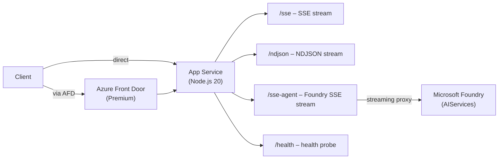

# Azure Front Door Streaming Test

A minimal test harness to verify whether **Azure Front Door (Premium)** buffers or passes through streaming HTTP responses (SSE and NDJSON), including real **Microsoft Foundry** agent streams.

## Architecture



## Purpose

Azure Front Door is a global load-balancer/CDN. There is uncertainty about whether it buffers long-lived streaming responses (SSE, NDJSON) before forwarding them to clients. This repo deploys a Node.js server with streaming endpoints, exposes them both directly and via AFD, and provides a shell script to measure per-chunk arrival times and detect buffering.

The `/sse` and `/ndjson` endpoints use fixed-interval mock data, while `/sse-agent` calls an actual **Microsoft Foundry** model deployment to test streaming with realistic AI inference characteristics (irregular timing, variable chunk sizes, model-speed token delivery).

## Prerequisites

| Tool | Notes |
|------|-------|
| [Azure CLI](https://learn.microsoft.com/cli/azure/install-azure-cli) | Authenticated (`az login`) |
| [azd CLI](https://learn.microsoft.com/azure/developer-cli/install-azd) | ≥ 1.9 |
| Node.js 20 LTS | Local dev / building |
| bash or WSL2 | Running `test.sh` |
| curl | Included in most Linux/macOS/WSL2 environments |

## Quick Start

### 1. Deploy infrastructure

```bash
azd up
```

Before provisioning, the `preprovision` hook (`scripts/preprovision.sh`) automatically
creates the target resource group with an optional set of custom tags. This is
useful when Azure Policy requires specific tags at resource-group creation time.

To apply custom tags, set the `PREPROVISION_RG_TAGS` environment variable (or
GitHub repository secret) to a JSON object:

```bash
export PREPROVISION_RG_TAGS='{"team":"platform","cost-center":"12345"}'
azd up
```

If `PREPROVISION_RG_TAGS` is unset or empty, the resource group is created with
only the default `azd-env-name` tag.

`azd up` provisions:
- Resource group
- App Service Plan (Linux B1)
- App Service (Node.js 20 LTS) with the Fastify server
- Azure Front Door Premium profile with a route forwarding `/*` to the App Service
- Microsoft Foundry account (AIServices) with a `gpt-4o-mini` model deployment

It prints the `SERVICE_APP_URI` (direct URL) and `AFD_URI` at the end.

### 2. Run the streaming test

```bash
chmod +x test.sh
./test.sh <SERVICE_APP_URI> <AFD_URI>
```

Example:

```bash
./test.sh \
  https://app-abc123.azurewebsites.net \
  https://streaming-test-abc123.z01.azurefd.net
```

The script tests `/sse`, `/ndjson`, and `/sse-agent` against both URLs and prints a per-chunk timing table, then concludes with **PASS** or **FAIL**. The `/sse-agent` test is automatically skipped if Microsoft Foundry is not configured.

### 3. Tear down

```bash
azd down
```

## Endpoints

| Endpoint | Content-Type | Description |
|----------|-------------|-------------|
| `GET /sse` | `text/event-stream` | Sends 10 SSE events at 1-second intervals |
| `GET /ndjson` | `application/x-ndjson` | Sends 10 JSON lines at 1-second intervals |
| `GET /sse-agent` | `text/event-stream` | Proxies a streaming chat completion from Microsoft Foundry |
| `GET /health` | `application/json` | Returns `{"status":"ok"}` – used by AFD health probe |

## Test Script Behaviour

`test.sh` accepts two positional arguments:

1. `DIRECT_URL` – base URL of the App Service
2. `AFD_URL` – base URL of the Azure Front Door endpoint

For each endpoint and each URL it:

1. Opens a streaming `curl -N` request
2. Records the elapsed time (in seconds) when each chunk arrives
3. Prints a comparison table with per-chunk arrival times and the delta between direct and AFD
4. Flags chunks where AFD lags more than **2 seconds** behind direct as `BATCHED`
5. Also detects total buffering if all AFD chunks arrive within 2 seconds of each other

**Exit code 0** = PASS, **exit code 1** = FAIL.

## Results

| Scenario | Expected | Observed |
|----------|----------|----------|
| SSE via AFD | Streaming (≤2 s lag per chunk) | ✅ Streaming — per-chunk Δ from −0.003 s to +0.007 s |
| NDJSON via AFD | Streaming (≤2 s lag per chunk) | ✅ Streaming — per-chunk Δ from +0.033 s to +0.068 s |

> Tested 2026-04-03 in Japan East. Azure Front Door Premium passes through SSE and NDJSON streams without buffering.

## Local Development

```bash
cd app
npm install
npm start
# Server listens on http://localhost:3000
```

Test locally:

```bash
curl -N http://localhost:3000/sse
curl -N http://localhost:3000/ndjson
```

## Azure Resources

This project provisions the following Azure resources:

| Resource | Type | Purpose |
|----------|------|---------|
| Resource Group | `Microsoft.Resources/resourceGroups` | Container for all resources |
| App Service Plan | `Microsoft.Web/serverfarms` | Linux B1 hosting plan |
| App Service | `Microsoft.Web/sites` | Node.js 20 LTS Fastify server |
| Azure Front Door | `Microsoft.Cdn/profiles` | Premium CDN/load-balancer |
| Microsoft Foundry | `Microsoft.CognitiveServices/accounts` (kind: `AIServices`) | AI model hosting |
| Model Deployment | `Microsoft.CognitiveServices/accounts/deployments` | `gpt-4o-mini` for streaming chat |

### Microsoft Foundry Configuration

The App Service receives three environment variables from the Foundry deployment:

| Variable | Description |
|----------|-------------|
| `FOUNDRY_ENDPOINT` | Cognitive Services account endpoint URL |
| `FOUNDRY_API_KEY` | API key for authentication |
| `FOUNDRY_DEPLOYMENT_NAME` | Name of the deployed model (default: `gpt-4o-mini`) |

The `/sse-agent` endpoint returns HTTP 503 when these variables are not configured, and `test.sh` automatically skips the agent test in that case.

### Resource Group Tags (CI/CD)

The `e2e-test` and `azd-manage` workflows pass the `PREPROVISION_RG_TAGS`
repository secret to the `preprovision` hook. To apply custom tags during CI/CD
provisioning, add a repository secret named `PREPROVISION_RG_TAGS` containing a
JSON object:

```json
{"team":"platform","cost-center":"12345"}
```

If the secret is not configured, the resource group is created with only the
default `azd-env-name` tag.

## Technology Reference

> ⚠️ **Important:** Microsoft Foundry and Azure AI Foundry are **not interchangeable** and use **different ARM resource providers**.

| Technology | ARM Resource Type |
|-----------|-------------------|
| **Microsoft Foundry** (this repo) | `Microsoft.CognitiveServices/accounts` (kind: `AIServices`) |
| **Model Deployments** (this repo) | `Microsoft.CognitiveServices/accounts/deployments` |
| Azure AI Foundry (Hub) | `Microsoft.MachineLearningServices/workspaces` (kind: `Hub`) |
| Azure AI Foundry (Project) | `Microsoft.MachineLearningServices/workspaces` (kind: `Project`) |

This repository uses **Microsoft Foundry** (`Microsoft.CognitiveServices`) exclusively.

## License

[MIT](LICENSE)