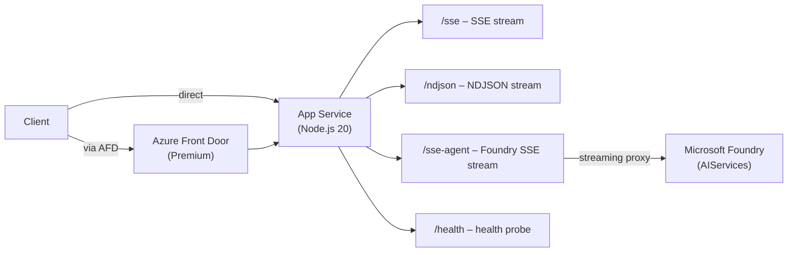

# Azure Front Door Streaming Test

A minimal test harness to verify whether **Azure Front Door (Premium)** buffers or passes through streaming HTTP responses (SSE and NDJSON), including real **Microsoft Foundry** agent streams.

## Architecture


```mermaid
flowchart LR
    Client -->|direct| AppService["App Service\n(Node.js 20)"]
    Client -->|via AFD| AFD["Azure Front Door\n(Premium)"]
    AFD --> AppService
    AppService --> SSE["/sse – SSE stream"]
    AppService --> NDJSON["/ndjson – NDJSON stream"]
    AppService --> SSEAgent["/sse-agent – Foundry SSE stream"]
    AppService --> Health["/health – health probe"]
    SSEAgent -->|streaming proxy| Foundry["Microsoft Foundry\n(AIServices)"]
```

## Purpose

Azure Front Door is a global load-balancer/CDN. There is uncertainty about whether it buffers long-lived streaming responses (SSE, NDJSON) before forwarding them to clients. This repo deploys a Node.js server with streaming endpoints, exposes them both directly and via AFD, and provides a shell script to measure per-chunk arrival times and detect buffering.

The `/sse` and `/ndjson` endpoints use fixed-interval mock data, while `/sse-agent` calls an actual **Microsoft Foundry** model deployment to test streaming with realistic AI inference characteristics (irregular timing, variable chunk sizes, model-speed token delivery).

## Prerequisites

| Tool | Notes |
|------|-------|
| [Azure CLI](https://learn.microsoft.com/cli/azure/install-azure-cli) | Authenticated (`az login`) |
| [azd CLI](https://learn.microsoft.com/azure/developer-cli/install-azd) | ≥ 1.9 |
| Node.js 20 LTS | Local dev / building |
| bash or WSL2 | Running `test.sh` |
| curl | Included in most Linux/macOS/WSL2 environments |

## Quick Start

### 1. Create the resource group

```bash
az group create -n rg-myenv -l japaneast --tags "<key>=<value>"
```

### 2. Deploy infrastructure

```bash
azd up
```

Tags are set on the resource group via `az group create --tags` before
running `azd up`. Bicep references the existing resource group without
modifying its tags.

`azd up` provisions:
- Resource group
- App Service Plan (Linux B1)
- App Service (Node.js 20 LTS) with the Fastify server
- Azure Front Door Premium profile with cache rules for optimized and baseline static-asset behavior
- Log Analytics workspace receiving Azure Front Door access logs
- Microsoft Foundry account (AIServices) with a `gpt-4o-mini` model deployment

It prints the app, Front Door, and Log Analytics workspace outputs at the end.

### 2. Run the streaming test

```bash
chmod +x test.sh
./test.sh <SERVICE_APP_URI> <AFD_URI>
```

Example:

```bash
./test.sh \
  https://app-abc123.azurewebsites.net \
  https://streaming-test-abc123.z01.azurefd.net
```

The script tests `/sse`, `/ndjson`, and `/sse-agent` against both URLs and prints a per-chunk timing table, then concludes with **PASS** or **FAIL**. The `/sse-agent` test is automatically skipped if Microsoft Foundry is not configured.

### 3. Tear down

```bash
azd down
```

## Endpoints

| Endpoint | Content-Type | Description |
|----------|-------------|-------------|
| `GET /sse` | `text/event-stream` | Sends 10 SSE events at 1-second intervals |
| `GET /ndjson` | `application/x-ndjson` | Sends 10 JSON lines at 1-second intervals |
| `GET /sse-agent` | `text/event-stream` | Proxies a streaming chat completion from Microsoft Foundry when an API key is configured |
| `GET /static-test/cacheable/{asset}` | varies | Cacheable static assets for AFD cache-status checks |
| `GET /static-test/no-store/{asset}` | varies | Static assets that intentionally opt out of caching |
| `GET /static-test/no-cache-control/{asset}` | varies | Static assets served with **no** `Cache-Control` header, so AFD falls back to its own default cache duration |
| `GET /static-test/query/{asset}` | varies | Cacheable static assets for query-string cache checks |
| `GET /static-test/large/large.txt` | `text/plain` | Larger text asset for size/compression checks |
| `GET /static-test/{scenario}/{token}/{asset}` | varies | Same as above, with an ignored `{token}` segment so a test arm can claim a distinct AFD cache key |
| `GET /cache-baseline/static-test/query/{asset}` | varies | Baseline cache rule using query strings in the cache key |
| `GET /health` | `application/json` | Returns `{"status":"ok"}` – used by AFD health probe |

## Test Script Behaviour

`test.sh` accepts two positional arguments:

1. `DIRECT_URL` – base URL of the App Service
2. `AFD_URL` – base URL of the Azure Front Door endpoint

For each endpoint and each URL it:

1. Opens a streaming `curl -N` request
2. Records the elapsed time (in seconds) when each chunk arrives
3. Prints a comparison table with per-chunk arrival times and the delta between direct and AFD
4. Flags chunks where AFD lags more than **2 seconds** behind direct as `BATCHED`
5. Also detects total buffering if all AFD chunks arrive within 2 seconds of each other

**Exit code 0** = PASS, **exit code 1** = FAIL.

## Front Door Cache Tests

Three additional scripts read the Front Door access log from Log Analytics. Only
`log-test.sh` is part of the CI gate; run the other two by hand against a deployed
environment.

| Script | Purpose | In CI gate |
|--------|---------|------------|
| `log-test.sh <workspace-customer-id> <afd-url>` | Verifies AFD access logs reach Log Analytics with the columns the other tests need | yes |
| `cache-test.sh <workspace-customer-id> <afd-baseline-url> <afd-url>` | Compares MISS rates between the query-string-keyed baseline route and the query-string-ignoring route | no |
| `auth-cache-test.sh <workspace-customer-id> <afd-url> [direct-url]` | Records how AFD reports cache status when an `Authorization` header suppresses caching | no |

Get the arguments from `azd env get-value LOG_ANALYTICS_WORKSPACE_CUSTOMER_ID`,
`azd env get-value AFD_URI`, `azd env get-value AFD_BASELINE_URI`, and
`azd env get-value SERVICE_APP_URI`.

### `auth-cache-test.sh`

[Front Door's caching docs](https://learn.microsoft.com/en-us/azure/frontdoor/front-door-caching)
say a request carrying an `Authorization` header isn't cached unless the response
carries a `Cache-Control` directive that permits caching, but they don't say which
cache status such a response reports. This script measures it, using one asset and
three arms:

| Arm | `Authorization` | Origin `Cache-Control` | Expected |
|-----|-----------------|------------------------|----------|
| 1 | absent | absent | 2nd request HIT — AFD's default 1–3 day cache applies |
| 2 | present | absent | stays MISS |
| 3 | present | `public, max-age=300` | 2nd request HIT |

Hypotheses: **H1** — arm 2 is reported as `X-Cache: TCP_MISS` rather than
`PRIVATE_NOSTORE`. **H2** — `Cache-Control: public, max-age=300` restores caching for
the same authorized request. H1 is falsified if arm 2 turns HIT.

Two details make the arms trustworthy:

- With no `Cache-Control`, AFD caches for a **random 1–3 days**, so arm 1 can leave an
  object that makes arm 2 falsely HIT. Every arm therefore uses a **unique path**
  (`/static-test/{scenario}/{run-id}-{arm}/app.js`). Waiting doesn't help, because the
  cache is per-POP.
- Query strings can't provide that uniqueness: the `static-test/` route runs with
  `queryStringCachingBehavior: IgnoreQueryString`. That is exactly why they are safe
  to use as per-request labels (`?run=...&req=N`), which is how log rows are attributed
  back to an arm.

All arms stay on the same route, so no redeployment happens mid-run. The script prints
`X-Cache`, `Age`, `X-Cache-Info`, `Cache-Control`, and `Content-Encoding` per request,
then the `cacheStatus_s` value from the access log. Its exit code reflects whether the
experiment was **conclusive** — a falsified hypothesis is a result, not a failure — so
it exits non-zero only when requests fail, logs never arrive, the unauthenticated
control arm never caches, or a cache status turns up that the script has no validated
meaning for.

That last guard matters. Classifying a status as a hit requires a vocabulary, and
hardcoding one is circular when establishing that vocabulary is itself an open
question. Statuses are therefore split into **confirmed** (observed here, meaning
settled), **uninterpreted** (documented by Microsoft but never observed here), and
unrecognised. Hitting either of the latter two stops the run and says so, rather than
silently folding an unknown hit into "not a hit" and then blaming the control arm for
never caching. Classification happens in bash over raw log rows, not in an `in (...)`
KQL clause, so there is one vocabulary to audit. `timeTaken` is reported alongside as
an origin-fetch signal that owes nothing to the vocabulary, and the script warns if the
timing ordering contradicts the status classification.

Confirmed so far: `HIT`, `REMOTE_HIT`, `MISS` and their `X-Cache` counterparts
`TCP_HIT`, `TCP_REMOTE_HIT`, `TCP_MISS`. Still uninterpreted: `PARTIAL_HIT`,
`PRIVATE_NOSTORE`, `CACHE_NOCONFIG`, `N/A`.

The `Authorization` value it sends is a throwaway placeholder. Front Door only needs
the header to be present, and the origin never inspects it. Pass `AZ_SUBSCRIPTION` if
the workspace isn't in the az CLI's default subscription.

#### Recorded result

Three runs, 2026-07-29, Japan East, Front Door Premium, asset `app.js`, all served by
the `TYO` POP (`auth-cache-20260729T024205Z`, `...T030333Z`, `...T030634Z`):

| Arm | Request 1 | Requests 2–3 | Post-prime `cacheStatus` |
|-----|-----------|--------------|--------------------------|
| 1 — no `Authorization`, no `Cache-Control` | `TCP_MISS` ×3 | cached in 3/3 runs | HIT, REMOTE_HIT |
| 2 — `Authorization`, no `Cache-Control` | `TCP_MISS` ×3 | **never cached, 6/6 requests `TCP_MISS`** | MISS |
| 3 — `Authorization`, `public, max-age=300` | `TCP_MISS` ×3 | cached in 3/3 runs | HIT, REMOTE_HIT |

**H1 supported.** An auth-suppressed response reports `X-Cache: TCP_MISS` and
`cacheStatus: MISS` — *not* `PRIVATE_NOSTORE`, which the docs reserve for a
`Cache-Control` of `private` or `no-store`. `timeTaken` corroborates the arm-2 misses
as real origin fetches: in every run arm 2's slowest post-prime request was slower than
the cached control arm's (0.028–0.121 s against 0.001–0.005 s).

**H2 supported.** `Cache-Control: public, max-age=300` restored caching for the
identical authorized request, in all three runs.

**The consequence is diagnostically negative.** Because an auth-suppressed response is
reported exactly like an ordinary cold miss, *no cache-status value can tell you the
`Authorization` header was the cause*. A `TCP_MISS` is not evidence of auth
suppression, and an access log alone can never establish it. The only way to implicate
this mechanism is to check whether the request actually carried an `Authorization`
header. Browsers don't attach one to `<script src>` or `<link href>` subresource
loads — only to explicit `fetch`/XHR calls — so for a plain static asset this mechanism
is usually the wrong suspect.

**Scope of these numbers.** Three runs, 27 requests, all served by a single POP —
`TYO`, confirmed from the access log's `pop_s` column rather than assumed. That is
enough to say the effect is reproducible and not a single-sample artefact, and the
result is further credible because the documented mechanism predicts it. It is *not*
enough to characterise Front Door as a whole: caching is per-POP, and POP-to-POP and
profile-to-profile behaviour is untested here.

Two incidental observations, offered as observations rather than properties:

- **No `Age` header, ever.** Absent from all 27 responses across the three runs, and
  from a separate probe that deliberately re-fetched cached objects at ~10 s, ~70 s and
  ~190 s of age on both scenarios. Consistent, but all from the `TYO` POP on one
  profile. If you have asked someone to report the `Age` header on a Front Door
  response, their "no such field" answer may be a property of Front Door rather than of
  their asset. Note also that `FrontDoorAccessLog` has **no `Age` column** — verified
  via `getschema` — so a log-based check and a response-header check are different
  questions, and only the latter is answerable at all.
- **`X-Cache-Info: L1_T2` / `L2_T2`**, undocumented. Where present it correlated
  perfectly with the tier that answered — `L1_T2` with every `TCP_HIT`, `L2_T2` with
  every `TCP_REMOTE_HIT`. It is not always sent. This makes the `TCP_HIT` ↔
  `TCP_REMOTE_HIT` alternation across requests ordinary edge-versus-regional tier
  routing rather than noise.

`Content-Encoding` was absent throughout: the assets sit below the compression size
floor.

## Results

| Scenario | Expected | Observed |
|----------|----------|----------|
| SSE via AFD | Streaming (≤2 s lag per chunk) | ✅ Streaming — per-chunk Δ from −0.003 s to +0.379 s |
| NDJSON via AFD | Streaming (≤2 s lag per chunk) | ✅ Streaming — per-chunk Δ from +0.021 s to +0.481 s |
| SSE-Agent (Foundry) via AFD | Streaming (≤2 s lag per chunk) | ✅ Streaming — per-chunk Δ from −0.140 s to +0.312 s |

> Tested 2026-04-04 in Japan East. Azure Front Door Premium passes through SSE, NDJSON, and Foundry agent streams without buffering.

## Local Development

```bash
cd app
npm install
npm start
# Server listens on http://localhost:3000
```

Test locally:

```bash
curl -N http://localhost:3000/sse
curl -N http://localhost:3000/ndjson
```

## Azure Resources

This project provisions the following Azure resources:

| Resource | Type | Purpose |
|----------|------|---------|
| Resource Group | `Microsoft.Resources/resourceGroups` | Container for all resources |
| App Service Plan | `Microsoft.Web/serverfarms` | Linux B1 hosting plan |
| App Service | `Microsoft.Web/sites` | Node.js 20 LTS Fastify server |
| Azure Front Door | `Microsoft.Cdn/profiles` | Premium CDN/load-balancer |
| Log Analytics Workspace | `Microsoft.OperationalInsights/workspaces` | Stores Azure Front Door access logs |
| Microsoft Foundry | `Microsoft.CognitiveServices/accounts` (kind: `AIServices`) | AI model hosting |
| Model Deployment | `Microsoft.CognitiveServices/accounts/deployments` | `gpt-4o-mini` for streaming chat |

### Microsoft Foundry Configuration

The App Service receives Foundry environment variables from the deployment:

| Variable | Description |
|----------|-------------|
| `FOUNDRY_ENDPOINT` | Cognitive Services account endpoint URL |
| `FOUNDRY_API_KEY` | API key for authentication |
| `FOUNDRY_DEPLOYMENT_NAME` | Name of the deployed model (default: `gpt-4o-mini`) |

The `/sse-agent` endpoint returns HTTP 503 when these variables are not configured, and `test.sh` automatically skips the agent test in that case.

### Resource Group Tags (CI/CD)

The `e2e-test` and `azd-manage` workflows create the resource group with
`az group create --tags` before running `azd`. They read the `RG_TAG_NAME`
and `RG_TAG_VALUE` repository secrets to apply a custom tag. If the secrets
are not configured, the resource group is created without custom tags.

## Technology Reference

> ⚠️ **Important:** Microsoft Foundry and Azure AI Foundry are **not interchangeable** and use **different ARM resource providers**.

| Technology | ARM Resource Type |
|-----------|-------------------|
| **Microsoft Foundry** (this repo) | `Microsoft.CognitiveServices/accounts` (kind: `AIServices`) |
| **Model Deployments** (this repo) | `Microsoft.CognitiveServices/accounts/deployments` |
| Azure AI Foundry (Hub) | `Microsoft.MachineLearningServices/workspaces` (kind: `Hub`) |
| Azure AI Foundry (Project) | `Microsoft.MachineLearningServices/workspaces` (kind: `Project`) |

This repository uses **Microsoft Foundry** (`Microsoft.CognitiveServices`) exclusively.

## License

[MIT](LICENSE)