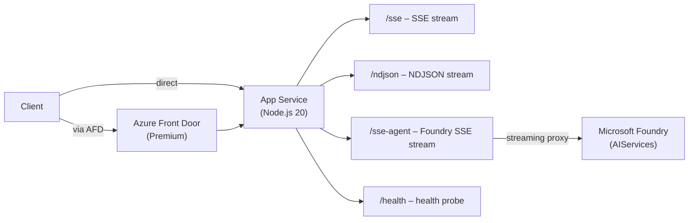

# Azure Front Door Streaming Test

A minimal test harness to verify whether **Azure Front Door (Premium)** buffers or passes through streaming HTTP responses (SSE and NDJSON), including real **Microsoft Foundry** agent streams.

## Architecture


```mermaid
flowchart LR
    Client -->|direct| AppService["App Service\n(Node.js 20)"]
    Client -->|via AFD| AFD["Azure Front Door\n(Premium)"]
    AFD --> AppService
    AppService --> SSE["/sse – SSE stream"]
    AppService --> NDJSON["/ndjson – NDJSON stream"]
    AppService --> SSEAgent["/sse-agent – Foundry SSE stream"]
    AppService --> Health["/health – health probe"]
    SSEAgent -->|streaming proxy| Foundry["Microsoft Foundry\n(AIServices)"]
```

## Purpose

Azure Front Door is a global load-balancer/CDN. There is uncertainty about whether it buffers long-lived streaming responses (SSE, NDJSON) before forwarding them to clients. This repo deploys a Node.js server with streaming endpoints, exposes them both directly and via AFD, and provides a shell script to measure per-chunk arrival times and detect buffering.

The `/sse` and `/ndjson` endpoints use fixed-interval mock data, while `/sse-agent` calls an actual **Microsoft Foundry** model deployment to test streaming with realistic AI inference characteristics (irregular timing, variable chunk sizes, model-speed token delivery).

Streaming is the primary question. Because the deployment already provides an origin behind Front Door with access logging wired up, the repo also carries a secondary set of scripts that probe AFD **caching** behaviour — see [Front Door Cache Tests](#front-door-cache-tests).

## Prerequisites

| Tool | Notes |
|------|-------|
| [Azure CLI](https://learn.microsoft.com/cli/azure/install-azure-cli) | Authenticated (`az login`) |
| [azd CLI](https://learn.microsoft.com/azure/developer-cli/install-azd) | ≥ 1.9 |
| Node.js 20 LTS | Local dev / building |
| bash or WSL2 | Running `test.sh` |
| curl | Included in most Linux/macOS/WSL2 environments |

## Quick Start

### 1. Create the resource group

```bash
az group create -n rg-myenv -l japaneast --tags "<key>=<value>"
```

### 2. Deploy infrastructure

```bash
azd up
```

Tags are set on the resource group via `az group create --tags` before
running `azd up`. Bicep references the existing resource group without
modifying its tags.

`azd up` provisions:
- Resource group
- App Service Plan (Linux B1)
- App Service (Node.js 20 LTS) with the Fastify server
- Azure Front Door Premium profile with cache rules for optimized and baseline static-asset behavior
- Log Analytics workspace receiving Azure Front Door access logs
- Microsoft Foundry account (AIServices) with a `gpt-4o-mini` model deployment

It prints the app, Front Door, and Log Analytics workspace outputs at the end.

### 2. Run the streaming test

```bash
chmod +x test.sh
./test.sh <SERVICE_APP_URI> <AFD_URI>
```

Example:

```bash
./test.sh \
  https://app-abc123.azurewebsites.net \
  https://streaming-test-abc123.z01.azurefd.net
```

The script tests `/sse`, `/ndjson`, and `/sse-agent` against both URLs and prints a per-chunk timing table, then concludes with **PASS** or **FAIL**. The `/sse-agent` test is automatically skipped if Microsoft Foundry is not configured.

### 3. Tear down

```bash
azd down
```

## Endpoints

| Endpoint | Content-Type | Description |
|----------|-------------|-------------|
| `GET /sse` | `text/event-stream` | Sends 10 SSE events at 1-second intervals |
| `GET /ndjson` | `application/x-ndjson` | Sends 10 JSON lines at 1-second intervals |
| `GET /sse-agent` | `text/event-stream` | Proxies a streaming chat completion from Microsoft Foundry when an API key is configured |
| `GET /static-test/cacheable/{asset}` | varies | Cacheable static assets for AFD cache-status checks |
| `GET /static-test/no-store/{asset}` | varies | Static assets that intentionally opt out of caching |
| `GET /static-test/no-cache-control/{asset}` | varies | Static assets served with **no** `Cache-Control` header, so AFD falls back to its own default cache duration |
| `GET /static-test/query/{asset}` | varies | Cacheable static assets for query-string cache checks |
| `GET /static-test/large/large.txt` | `text/plain` | Larger text asset for size/compression checks |
| `GET /static-test/{scenario}/{token}/{asset}` | varies | Same as above, with an ignored `{token}` segment so a test arm can claim a distinct AFD cache key |
| `GET /cache-baseline/static-test/query/{asset}` | varies | Baseline cache rule using query strings in the cache key |
| `GET /health` | `application/json` | Returns `{"status":"ok"}` – used by AFD health probe |

## Test Script Behaviour

`test.sh` accepts two positional arguments:

1. `DIRECT_URL` – base URL of the App Service
2. `AFD_URL` – base URL of the Azure Front Door endpoint

For each endpoint and each URL it:

1. Opens a streaming `curl -N` request
2. Records the elapsed time (in seconds) when each chunk arrives
3. Prints a comparison table with per-chunk arrival times and the delta between direct and AFD
4. Flags chunks where AFD lags more than **2 seconds** behind direct as `BATCHED`
5. Also detects total buffering if all AFD chunks arrive within 2 seconds of each other

**Exit code 0** = PASS, **exit code 1** = FAIL.

## Results

| Scenario | Expected | Observed |
|----------|----------|----------|
| SSE via AFD | Streaming (≤2 s lag per chunk) | ✅ Streaming — per-chunk Δ from −0.003 s to +0.379 s |
| NDJSON via AFD | Streaming (≤2 s lag per chunk) | ✅ Streaming — per-chunk Δ from +0.021 s to +0.481 s |
| SSE-Agent (Foundry) via AFD | Streaming (≤2 s lag per chunk) | ✅ Streaming — per-chunk Δ from −0.140 s to +0.312 s |

> Tested 2026-04-04 in Japan East. Azure Front Door Premium passes through SSE, NDJSON, and Foundry agent streams without buffering.

## Front Door Cache Tests

Separate from the streaming question above, three scripts read the Front Door access
log from Log Analytics to check cache behaviour. Only `log-test.sh` is part of the CI
gate; run the other two by hand against a deployed environment.

| Script | Purpose | In CI gate |
|--------|---------|------------|
| `log-test.sh <workspace-customer-id> <afd-url>` | Verifies AFD access logs reach Log Analytics with the columns the other tests need | yes |
| `cache-test.sh <workspace-customer-id> <afd-baseline-url> <afd-url>` | Compares MISS rates between the query-string-keyed baseline route and the query-string-ignoring route | no |
| `auth-cache-test.sh <workspace-customer-id> <afd-url> [direct-url]` | Records how AFD reports cache status when an `Authorization` header suppresses caching | no |

Get the arguments from `azd env get-value LOG_ANALYTICS_WORKSPACE_CUSTOMER_ID`,
`azd env get-value AFD_URI`, `azd env get-value AFD_BASELINE_URI`, and
`azd env get-value SERVICE_APP_URI`.

> **Maintenance.** `cache-test.sh` and `auth-cache-test.sh` need a live deployment,
> Log Analytics access and the `az` CLI, so no CI job runs them and **nothing will
> report it if they break**. They are ungated for different reasons. `cache-test.sh`
> is a regression check that isn't gateable yet: its 2026-07-09 run saw only 20 of 24
> expected access-log rows, and that delivery gap is unresolved. `auth-cache-test.sh`
> is an experiment, where a changed result is a finding to read rather than a build to
> fail. Re-run both by hand when touching `app/server.js` static-asset routes or the
> Front Door rule set in `infra/modules/frontdoor.bicep`, and expect to fix bit-rot
> when you do.

### Finding: `Authorization` suppresses caching, reported as an ordinary MISS

A request carrying an `Authorization` header isn't cached unless the response permits
it via `Cache-Control` — and Front Door reports that suppression as plain
`X-Cache: TCP_MISS` / `cacheStatus: MISS`, not `PRIVATE_NOSTORE`. Adding
`Cache-Control: public, max-age=300` restores caching for the identical request.

The consequence is **diagnostically negative**: an auth-suppressed response is
indistinguishable from an ordinary cold miss, so no cache status can prove the header
was the cause — you have to inspect the request headers instead.

The recorded three-run results, the confirmed cache-status vocabulary, and two
incidental findings are in
[docs/auth-cache-result.md](docs/auth-cache-result.md); the method is documented in the
script's own header comment.

## Local Development

```bash
cd app
npm install
npm start
# Server listens on http://localhost:3000
```

Test locally:

```bash
curl -N http://localhost:3000/sse
curl -N http://localhost:3000/ndjson
```

## Azure Resources

This project provisions the following Azure resources:

| Resource | Type | Purpose |
|----------|------|---------|
| Resource Group | `Microsoft.Resources/resourceGroups` | Container for all resources |
| App Service Plan | `Microsoft.Web/serverfarms` | Linux B1 hosting plan |
| App Service | `Microsoft.Web/sites` | Node.js 20 LTS Fastify server |
| Azure Front Door | `Microsoft.Cdn/profiles` | Premium CDN/load-balancer |
| Log Analytics Workspace | `Microsoft.OperationalInsights/workspaces` | Stores Azure Front Door access logs |
| Microsoft Foundry | `Microsoft.CognitiveServices/accounts` (kind: `AIServices`) | AI model hosting |
| Model Deployment | `Microsoft.CognitiveServices/accounts/deployments` | `gpt-4o-mini` for streaming chat |

### Microsoft Foundry Configuration

The App Service receives Foundry environment variables from the deployment:

| Variable | Description |
|----------|-------------|
| `FOUNDRY_ENDPOINT` | Cognitive Services account endpoint URL |
| `FOUNDRY_API_KEY` | API key for authentication |
| `FOUNDRY_DEPLOYMENT_NAME` | Name of the deployed model (default: `gpt-4o-mini`) |

The `/sse-agent` endpoint returns HTTP 503 when these variables are not configured, and `test.sh` automatically skips the agent test in that case.

### Resource Group Tags (CI/CD)

The `e2e-test` and `azd-manage` workflows create the resource group with
`az group create --tags` before running `azd`. They read the `RG_TAG_NAME`
and `RG_TAG_VALUE` repository secrets to apply a custom tag. If the secrets
are not configured, the resource group is created without custom tags.

## Technology Reference

> ⚠️ **Important:** Microsoft Foundry and Azure AI Foundry are **not interchangeable** and use **different ARM resource providers**.

| Technology | ARM Resource Type |
|-----------|-------------------|
| **Microsoft Foundry** (this repo) | `Microsoft.CognitiveServices/accounts` (kind: `AIServices`) |
| **Model Deployments** (this repo) | `Microsoft.CognitiveServices/accounts/deployments` |
| Azure AI Foundry (Hub) | `Microsoft.MachineLearningServices/workspaces` (kind: `Hub`) |
| Azure AI Foundry (Project) | `Microsoft.MachineLearningServices/workspaces` (kind: `Project`) |

This repository uses **Microsoft Foundry** (`Microsoft.CognitiveServices`) exclusively.

## License

[MIT](LICENSE)